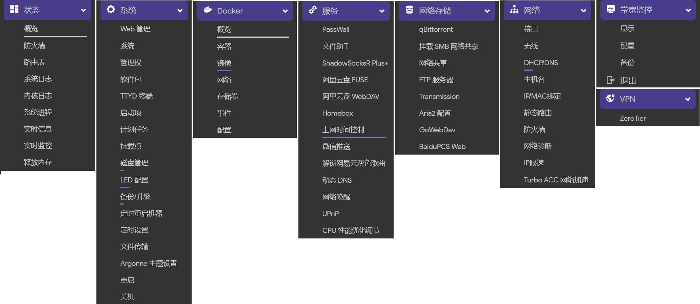
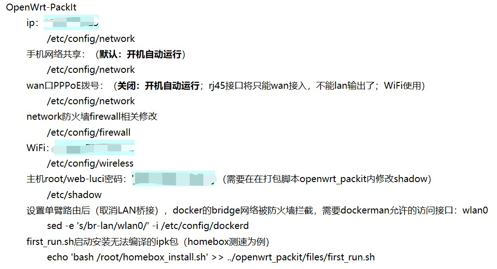

### **个人自用的固件编译**
**Amlogic平台的N1盒子OpenWrt固件信息：**
默认IP: `192.168.5.25`
默认用户名: `root`
默认密码: `password`

#### action-n1-5.10.x-max-compile:  ####

#### 修改 [openwrt_packit](https://github.com/unifreq/openwrt_packit) 脚本，打包固件时，添加默认配置：如wifi，root密码，宽带密码，network，firewall配置等 ####
- openwrt_packit/make.env
- openwrt_packit/mk_s905d_n1.sh
- openwrt_packit/files/first_run.sh
#### 私人打包仓库：https://github.com/sswdr/OpenWrt-PackIt

 
## 感谢
- https://github.com/coolsnowwolf/lede
- https://github.com/unifreq/openwrt_packit
- https://github.com/kenzok8/openwrt-packages
- https://github.com/P3TERX/Actions-OpenWrt
- https://github.com/quanjindeng/Actions_OpenWrt-Amlogic
- 所有OpenWrt源码贡献者、插件开发者

## License
[MIT](https://github.com/P3TERX/Actions-OpenWrt/blob/main/LICENSE) © [**P3TERX**](https://p3terx.com)
